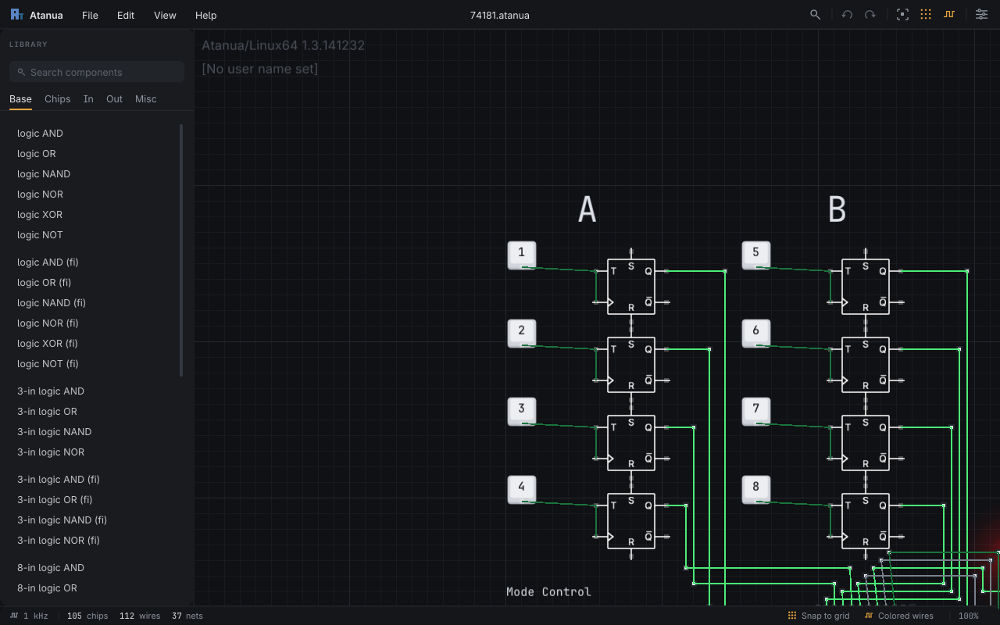
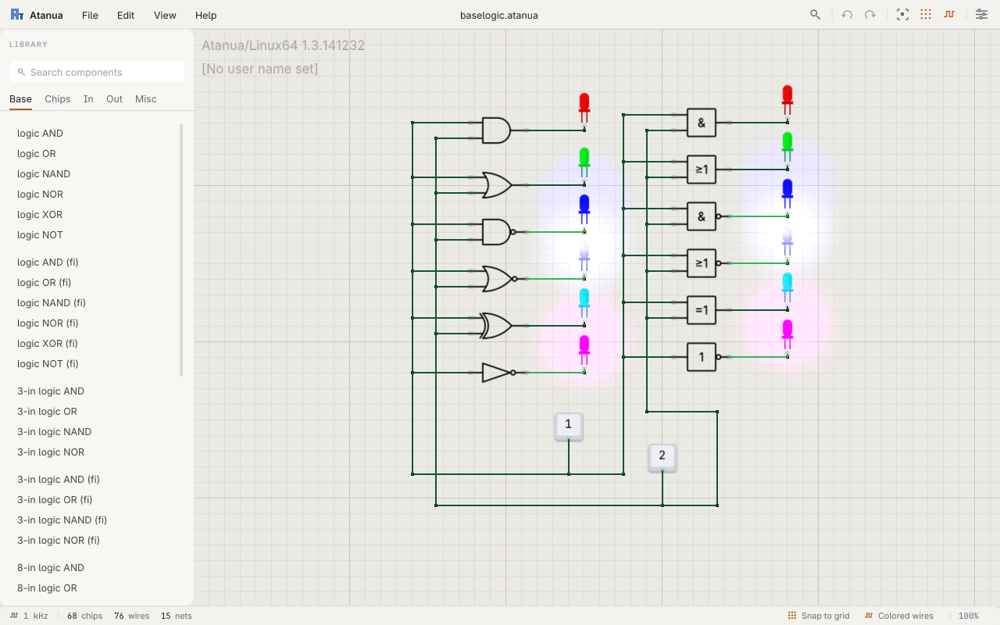
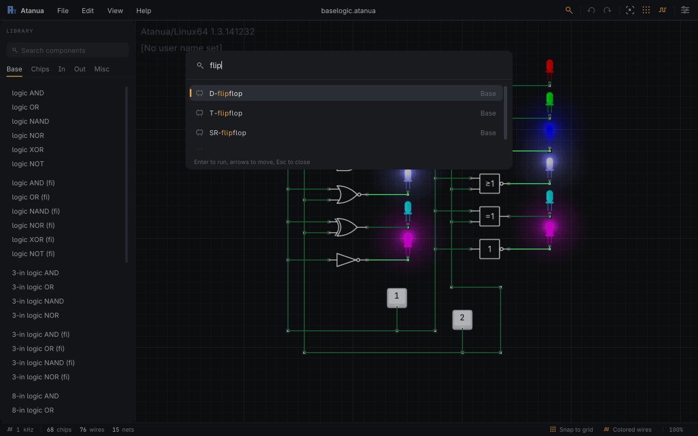
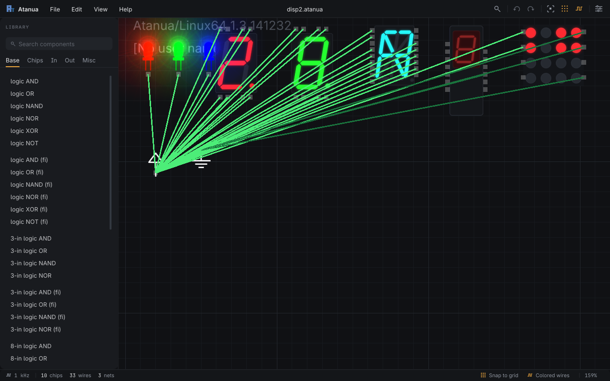
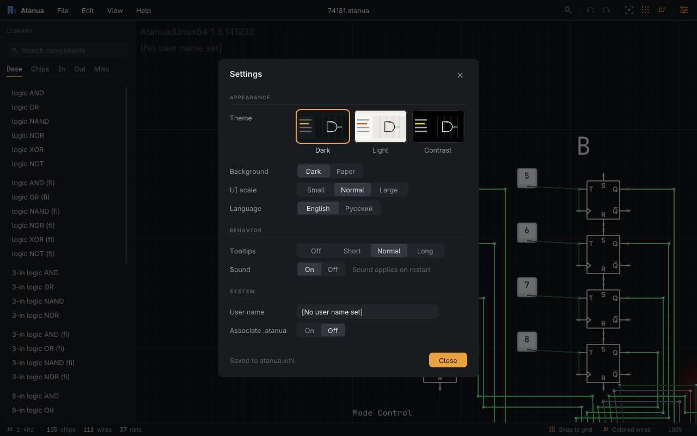

# Atanua Prime — Real-Time Logic Simulator

**[English](#english) | [Русский](#russian)**



---

<a id="english"></a>
## English

Atanua Prime is a real-time logic simulator for education and digital-circuit experimentation. It is a modernized fork of [jarikomppa/atanua](https://github.com/jarikomppa/atanua), the open-source release of the former commercial product (2008–2014).

Place logic chips on the canvas, wire their pins together, and watch the circuit simulate live. The default simulation rate is 1 kHz (`PhysicsKHz` in `atanua.xml`).

### Download

Prebuilt packages are published on [Releases](https://github.com/ProGaMEr110521/atanua-prime/releases) when a `v*` version tag is pushed:

- Windows: `atanua-windows-x64.zip` (self-contained archive with runtime DLLs when needed)
- Linux: `atanua-linux-x86_64.tar.gz`

Plain branch pushes build in CI but do not publish release archives.

### The interface

| | |
|---|---|
|  |  |
|  |  |

- **Header** — File / Edit / View / Help menus, the open design's name, and icon buttons for the command palette, undo/redo, zoom to fit, snap and colored wires, and settings.
- **Component library** — searches every category at once (`Ctrl+F`), tab strip per category, family grouping, a Recent group, and hover cards with each part's description. Drag the right edge to resize it.
- **Command palette** (`Ctrl+K`) — fuzzy search over every command and every component, in English and Russian. Enter runs a command or picks up a part; click to drop it.
- **Canvas** — every chip, display and hardware part redrawn as crisp vector art at 4x the old resolution; wires share the parts' stroke weight; text renders from real fonts at the on-screen size, so it stays sharp at any zoom. Hover a pin or wire for its live signal (High / Low / Floating / Conflict).
- **Status bar** — simulation rate, chip/wire/net counts, selection size, and one-click Snap, Colored wires and zoom-to-fit.
- **Themes** — Dark (graphite with an amber accent), Light and Contrast, plus a separate Dark / Paper canvas. Type is Inter (with its disambiguated I / l / 1) and JetBrains Mono for numbers and part names.
- **Dialogs** — Settings, a keyboard shortcuts sheet (`F1`), and About.

### What else is new in Prime

- **Click-to-bend wiring** — left-click the middle of a wire to insert a bend point; drag the anchor to reposition it.
- **Route-through anchors** — while drawing a wire, click empty canvas to drop routing anchors; releasing near a pin snaps the connection to that pin.
- **Magnetic anchors and pins** — bend points have separate inner (start wire) and outer (move) hit zones; pins have padded grab areas that win over nearby wires.
- **Undo/redo** — snapshot history capped at 100 steps and 64 MiB total.
- **Settings** — language (English / Russian), theme, canvas background, UI scale, tooltip delay, sound, user name, and `.atanua` file association; choices persist in `atanua.xml`.
- **Auto-update (Windows)** — on launch, the app checks GitHub releases and can download, install, and restart when a newer tagged build is available.
- **CI** — every push and pull request builds on Windows and Ubuntu; tagged releases additionally package and publish both platform archives.

### Controls

| Action | How |
|---|---|
| Place a part | Drag from the library, or `Ctrl+K`, type, `Enter`, click |
| Move part / anchor | Drag the part body (outer ring on anchors) |
| Start / finish a wire | Drag pin to pin, or click pin, click empty spots, click target pin |
| Bend a wire | Left-click the middle of a wire; drag the created dot |
| Branch from a pin / anchor | Drag from the inner square |
| Select all / Rotate / Nudge | `Ctrl+A` / `Ctrl+R` / arrow keys |
| Delete selection | `Delete` or `Ctrl+D` |
| Undo / Redo | `Ctrl+Z` / `Ctrl+Y` (also `Ctrl+Shift+Z`) |
| New / Open / Merge / Import box / Save | `Ctrl+N` / `Ctrl+L` / `Ctrl+M` / `Ctrl+B` / `Ctrl+S` |
| Zoom in / out / fit / reset | `PgUp` or wheel / `PgDn` or wheel / `Ctrl+E` / `Ctrl+H` |
| Snap / Colored wires / Screenshot | `Ctrl+P` / `Ctrl+W` / `Ctrl+G` |
| Search library / Command palette / Shortcuts | `Ctrl+F` / `Ctrl+K` / `F1` |
| Optimize box | `Ctrl+O` |
| Cancel current action, close menus and dialogs | `Esc` |

### Build from source

Requirements: CMake 3.20+, a C++17 compiler, SDL2, OpenGL, and TinyXML2.

**Windows, Visual Studio** (2022+, vcpkg provides SDL2 and TinyXML2 via `vcpkg.json`):

```bat
cmake -S . -B build -DCMAKE_BUILD_TYPE=Release -DCMAKE_TOOLCHAIN_FILE=%VCPKG_ROOT%\scripts\buildsystems\vcpkg.cmake
cmake --build build --config Release
```

**Windows, MinGW-w64** (MSYS2, or cross-compiling from Linux) also works: point CMake at the SDL2 MinGW development package and a TinyXML2 build, e.g. `-DSDL2_DIR=<SDL2>/x86_64-w64-mingw32/lib/cmake/SDL2 -Dtinyxml2_DIR=<prefix>/lib/cmake/tinyxml2`, and ship `SDL2.dll` plus the MinGW runtime DLLs next to `atanua.exe`.

**Linux**:

```bash
sudo apt install build-essential cmake ninja-build libsdl2-dev libtinyxml2-dev libgl1-mesa-dev libglu1-mesa-dev libgtk-3-dev pkg-config curl
cmake -S . -B build -G Ninja -DCMAKE_BUILD_TYPE=Release
cmake --build build
```

Linux builds static-link TinyXML2. If `libtinyxml2.a` is missing (Ubuntu's `libtinyxml2-dev` is shared-only), CMake fetches TinyXML2 10.0.0 and builds it as a static library — the same path Ubuntu CI uses.

CMake copies `data/` (fonts, textures) next to the executable after each link; the app needs it there. After regenerating assets without relinking, copy `data/` again.

Run: `build\Release\atanua.exe` (Windows) or `./build/atanua` (Linux).

### Tests

```bash
python -m pytest tests/
```

Structural checks against the sources, the C++ unit tests (settings, theme, drag-and-drop, file association, file utilities, update logic), compiled on the fly, and, when a local build exists, runs of the binary over the circuits in `tests/fixtures/`.

### Regenerating art and fonts

Every sprite and font in `data/` that belongs to the new look is generated, so it can be changed and rebuilt instead of hand-edited. See [tools/README.md](tools/README.md).

| Script | Builds |
|---|---|
| `tools/sprites/gen_sprites.py` | Gates, latches, flip-flops, DX, MUX, GND/VCC, DIP packages, button, switch, clock |
| `tools/sprites/gen_displays.py` | 7-seg, 16-seg and TIL309 displays, LED, LED grid |
| `tools/sprites/gen_parts.py` | Logic probe, stepper motor, audio DAC, smoke-emitting diode |
| `tools/fonts/build_fonts.sh` | Inter (with `ss04` frozen in) and JetBrains Mono subsets for the UI |
| `tools/fonts/build_bmfonts.py` | Canvas bitmap fonts (fallback path) |

### Repository layout

| Path | Purpose |
|---|---|
| `src/core/main.cpp` | Canvas, simulation loop, input |
| `src/core/ui_chrome.cpp` | Header, library, status bar, dialogs, command palette, hover cards |
| `src/include/ui_theme.h` | Design tokens: one color palette per theme, spacing, canvas helpers |
| `src/include/app_settings.h` | Settings and every UI string (English / Russian) |
| `src/chip/` | Parts: logic, displays, hardware |
| `data/` | Runtime assets: sprites, fonts (with licenses) |
| `third_party/imgui/` | Vendored Dear ImGui |
| `tools/` | Asset generators |
| `tests/` | Regression tests and sample `.atanua` circuits |
| `docs/screenshots/` | Images used in this README |

### Changelog

See [CHANGELOG.md](CHANGELOG.md). Tagged release notes are taken from matching `## [vX]` sections when a version tag is published.

### Credits

Original Atanua by Jari Komppa (Sol / [jarikomppa](https://github.com/jarikomppa)). Prime keeps the simulation core and rebuilds the editor experience around it. UI type: [Inter](https://github.com/rsms/inter) (OFL) and [JetBrains Mono](https://github.com/JetBrains/JetBrainsMono); UI toolkit: [Dear ImGui](https://github.com/ocornut/imgui).

---

<a id="russian"></a>
## Русский

Atanua Prime — симулятор цифровой логики в реальном времени для учёбы и экспериментов. Это модернизированный форк [jarikomppa/atanua](https://github.com/jarikomppa/atanua), открытой версии бывшего коммерческого продукта (2008–2014).

Размещайте микросхемы на холсте, соединяйте выводы проводами и наблюдайте симуляцию вживую. Частота по умолчанию — 1 кГц (параметр `PhysicsKHz` в `atanua.xml`).

### Скачать

Готовые сборки публикуются на [Releases](https://github.com/ProGaMEr110521/atanua-prime/releases) при пуше тега `v*`:

- Windows: `atanua-windows-x64.zip` (архив со всем необходимым, включая DLL при необходимости)
- Linux: `atanua-linux-x86_64.tar.gz`

Обычные пуши веток собираются в CI, но архивы релизов не публикуют.

### Интерфейс

Скриншоты — в английском разделе выше.

- **Шапка** — меню Файл / Правка / Вид / Справка, имя открытой схемы и кнопки-иконки: палитра команд, отмена/возврат, вписать, привязка, цветные провода, настройки.
- **Библиотека компонентов** — поиск сразу по всем категориям (`Ctrl+F`), вкладки категорий, группы семейств, раздел «Недавние» и карточки с описанием при наведении. Ширину можно менять, потянув за правый край.
- **Палитра команд** (`Ctrl+K`) — нечёткий поиск по всем командам и компонентам на русском и английском. Enter выполняет команду или берёт компонент, который ставится кликом.
- **Холст** — все микросхемы, индикаторы и «железо» перерисованы в чёткой векторной графике (в 4 раза детальнее); провода той же толщины, что и линии компонентов; текст рисуется настоящими шрифтами в экранном размере и остаётся чётким при любом масштабе. Наведение на пин или провод показывает сигнал (Высокий / Низкий / Не подключено / Конфликт).
- **Строка состояния** — частота симуляции, число чипов/проводов/цепей, размер выделения и переключатели привязки, цветных проводов и масштаба.
- **Темы** — Тёмная (графит с янтарным акцентом), Светлая и Контрастная, отдельно фон холста Тёмный / Бумага. Шрифты — Inter (с различимыми I / l / 1) и JetBrains Mono для чисел и названий микросхем.
- **Окна** — Настройки, шпаргалка клавиш (`F1`) и «О программе».

### Что ещё нового в Prime

- **Изгибы в один клик** — клик по середине провода ставит точку изгиба; якорь можно перетащить.
- **Маршрутизация через якоря** — при ведении провода кликайте по пустому холсту для промежуточных якорей; отпускание рядом с выводом примагничивает соединение к нему.
- **Магнитные якоря и пины** — у точек изгиба отдельные зоны для нового провода (внутри) и перемещения (снаружи); у выводов расширенная зона захвата.
- **Undo/redo** — до 100 шагов и 64 МиБ суммарно.
- **Настройки** — язык, тема, фон холста, масштаб UI, задержка подсказок, звук, имя пользователя и ассоциация файлов `.atanua`; всё сохраняется в `atanua.xml`.
- **Автообновление (Windows)** — при запуске приложение проверяет релизы на GitHub и может скачать, установить и перезапуститься.
- **CI** — каждый push и pull request собирается под Windows и Ubuntu; по тегам дополнительно публикуются архивы обеих платформ.

### Управление

| Действие | Как |
|---|---|
| Поставить компонент | Перетащить из библиотеки, или `Ctrl+K`, ввести название, `Enter`, клик |
| Переместить компонент / якорь | Тащить за корпус (у якоря — за внешнее кольцо) |
| Начать / завершить провод | Тащить пин → пин, либо клики: пин, пустые места, целевой пин |
| Изогнуть провод | Клик по середине провода; перетащить точку |
| Ответвиться от пина / якоря | Тащить из внутреннего квадрата |
| Выделить всё / Повернуть / Сдвинуть | `Ctrl+A` / `Ctrl+R` / стрелки |
| Удалить выбранное | `Delete` или `Ctrl+D` |
| Отменить / вернуть | `Ctrl+Z` / `Ctrl+Y` (также `Ctrl+Shift+Z`) |
| Новый / Открыть / Добавить / Блок / Сохранить | `Ctrl+N` / `Ctrl+L` / `Ctrl+M` / `Ctrl+B` / `Ctrl+S` |
| Приблизить / отдалить / вписать / сбросить | `PgUp` или колесо / `PgDn` или колесо / `Ctrl+E` / `Ctrl+H` |
| Привязка / Цветные провода / Снимок экрана | `Ctrl+P` / `Ctrl+W` / `Ctrl+G` |
| Поиск в библиотеке / Палитра команд / Горячие клавиши | `Ctrl+F` / `Ctrl+K` / `F1` |
| Оптимизировать блок | `Ctrl+O` |
| Отменить действие, закрыть меню и окна | `Esc` |

### Сборка из исходников

Нужны CMake 3.20+, компилятор C++17, SDL2, OpenGL и TinyXML2.

**Windows, Visual Studio** (2022+, vcpkg для SDL2 и TinyXML2 через `vcpkg.json`):

```bat
cmake -S . -B build -DCMAKE_BUILD_TYPE=Release -DCMAKE_TOOLCHAIN_FILE=%VCPKG_ROOT%\scripts\buildsystems\vcpkg.cmake
cmake --build build --config Release
```

**Windows, MinGW-w64** (MSYS2 или кросс-сборка из Linux) тоже работает: укажите CMake пакет разработки SDL2 для MinGW и сборку TinyXML2, например `-DSDL2_DIR=<SDL2>/x86_64-w64-mingw32/lib/cmake/SDL2 -Dtinyxml2_DIR=<prefix>/lib/cmake/tinyxml2`, и положите `SDL2.dll` и DLL рантайма MinGW рядом с `atanua.exe`.

**Linux**:

```bash
sudo apt install build-essential cmake ninja-build libsdl2-dev libtinyxml2-dev libgl1-mesa-dev libglu1-mesa-dev libgtk-3-dev pkg-config curl
cmake -S . -B build -G Ninja -DCMAKE_BUILD_TYPE=Release
cmake --build build
```

На Linux TinyXML2 линкуется статически. Если нет `libtinyxml2.a` (у Ubuntu в `libtinyxml2-dev` только `.so`), CMake скачивает TinyXML2 10.0.0 и собирает статическую библиотеку — тот же путь, что в Ubuntu CI.

После каждой линковки CMake копирует `data/` (шрифты, текстуры) рядом с исполняемым файлом; без него приложение не работает. Если ресурсы пересобраны без перелинковки, скопируйте `data/` ещё раз.

Запуск: `build\Release\atanua.exe` (Windows) или `./build/atanua` (Linux).

### Тесты

```bash
python -m pytest tests/
```

Проверки исходников, модульные тесты C++ (настройки, тема, перетаскивание, ассоциация файлов, файлы, логика обновления), собираемые на лету и, при наличии сборки, прогоны бинарника на схемах из `tests/fixtures/`.

### Пересборка графики и шрифтов

Все спрайты и шрифты нового оформления в `data/` генерируются скриптами, так что их меняют и пересобирают, а не правят вручную. Подробнее — [tools/README.md](tools/README.md).

### Структура репозитория

| Путь | Назначение |
|---|---|
| `src/core/main.cpp` | Холст, цикл симуляции, ввод |
| `src/core/ui_chrome.cpp` | Шапка, библиотека, строка состояния, окна, палитра команд, карточки |
| `src/include/ui_theme.h` | Токены дизайна: палитра каждой темы, отступы, помощники холста |
| `src/include/app_settings.h` | Настройки и все строки интерфейса (EN / RU) |
| `src/chip/` | Компоненты: логика, индикаторы, «железо» |
| `data/` | Ресурсы: спрайты, шрифты (с лицензиями) |
| `third_party/imgui/` | Встроенный Dear ImGui |
| `tools/` | Генераторы ресурсов |
| `tests/` | Регрессионные тесты и примеры `.atanua` |
| `docs/screenshots/` | Изображения для README |

### Changelog

См. [CHANGELOG.md](CHANGELOG.md). Примечания к релизу берутся из секций `## [vX]` при публикации тега.

### Благодарности

Оригинальная Atanua — Jari Komppa (Sol / [jarikomppa](https://github.com/jarikomppa)). Prime сохраняет ядро симуляции и перестраивает редактор вокруг него. Шрифты интерфейса — [Inter](https://github.com/rsms/inter) (OFL) и [JetBrains Mono](https://github.com/JetBrains/JetBrainsMono); интерфейс на [Dear ImGui](https://github.com/ocornut/imgui).
